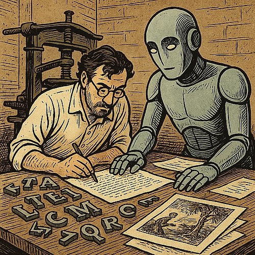

# Digitale Arbeitskladde (S. 139)
## Saarbrückener Ausgabe (Berlin, Saarbrücken 2025)  
_Eine CoBot-Edition, hg. von Tobias Kraft in Zusammenarbeit mit ChatGPT 5.1 Thinking_

<table style="border-collapse:collapse; width:100%; margin-top:1.2rem;">
  <tr style="border:none;">
    <td style="vertical-align:top; border:none; padding-right:1.5rem; width:55%;">

Diese Beispiel-Edition entstand im Rahmen eines KI-basierten Workflows, der für einen Vortrag auf der Konferenz **„Artifizielle Hermeneutik. Kontingenz, Sinn & Digitalität”** (19.–21. November 2025, Universität des Saarlandes, Saarbrücken) entwickelt wurde. Ziel war es, die grundlegenden Schritte einer digitalen Edition – von der Transkription bis zur Webpräsentation – mithilfe eines großen Sprachmodells durchzuführen und dabei einem konsequenten *expert-in-the-loop*-Ansatz zu folgen: Die Interaktion zwischen Mensch und Maschine konzentriert sich auf das Prompting, während die editorische Umsetzung so weit wie möglich dem Sprachmodell überlassen wird.

Im Mittelpunkt steht **eine einzelne Manuskriptseite** (Seite 139), die vollständig im CoBot-Modus erarbeitet wurde.

    </td>
    <td style="vertical-align:top; border:none; text-align:right; width:45%;">

    </td>
  </tr>
</table>

---

### Direkt zur Edition

👉 [Seite 139 – Live-Ansicht öffnen](viewer.html?doc=tei/ft-139.xml)

---

### XML-Quelle

🔗 [Ansicht/Download der TEI-XML-Datei (ft-139.xml)](https://github.com/trafikante/kladde/blob/main/tei/ft-139.xml)

---

### GitHub-Repositorium

🔗 [Root-Verzeichnis, README](https://github.com/trafikante/kladde)

---

### Vollständiger Chat-Verlauf 

🔗 [(Projektordner „25 Saarbrücken“ (Zugriff auf Anfrage)](https://chatgpt.com/g/g-p-691d77cf89d481919e25d3968974726e-25-saarbrucken/project)

