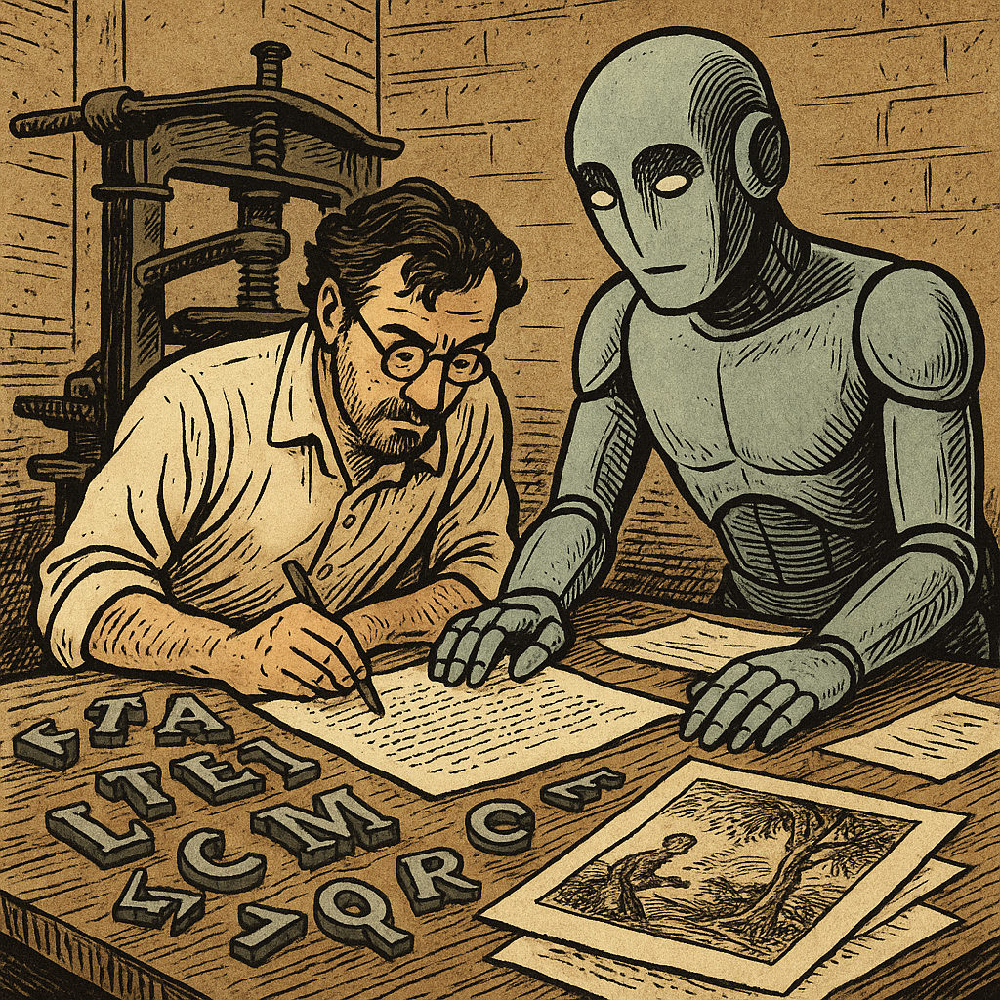

# Future Texts – Digitale Arbeitskladde  
## Saarbrückener Ausgabe (Berlin, Saarbrücken 2025)  
_Eine CoBot-Edition, hg. von Tobias Kraft in Zusammenarbeit mit ChatGPT 5.1 Thinking_

<table style="border-collapse:collapse; width:100%; margin-top:1.2rem;">
  <tr style="border:none;">
    <td style="vertical-align:top; border:none; padding-right:1.5rem; width:55%;">

Willkommen zur Startseite einer experimentellen digitalen Edition der Arbeitskladde *„Future Texts“*.  
Dieses Projekt erprobt einen *expert-in-the-loop*-Workflow: Die fein gesteuerten Eingaben des Editors (Prompting) werden mit der operativen Durchführung durch ein großes Sprachmodell kombiniert.

Im Mittelpunkt steht **eine einzelne Manuskriptseite** (Seite 139), die vollständig im CoBot-Modus erarbeitet wurde – von der Transkription über die TEI-Auszeichnung bis hin zu semantischen Annotationen und Stellenkommentar.  
Die Edition ist ein bewusst prototypischer Werkstattversuch.

    </td>
    <td style="vertical-align:top; border:none; text-align:right; width:45%;">

    </td>
  </tr>
</table>

---

### Direkt zur Edition

👉 **Seite 139 – Live-Ansicht öffnen:**  
[viewer.html?doc=tei/ft-139.xml](viewer.html?doc=tei/ft-139.xml)

---

### XML-Quelle

[Ansicht/Download der TEI-XML-Datei (ft-139.xml)](https://github.com/trafikante/kladde/blob/main/tei/ft-139.xml)

---

### GitHub-Repositorium

https://github.com/trafikante/kladde

---

### Vollständiger Chat-Verlauf (Projektordner „25 Saarbrücken“)

🔗  
https://chatgpt.com/g/g-p-691d77cf89d481919e25d3968974726e-25-saarbrucken/shared/c/69209d5e-1228-832d-8a6a-4c2fe9546361?owner_user_id=user-sHdb9BccpRDplywEfCOEZQ21
